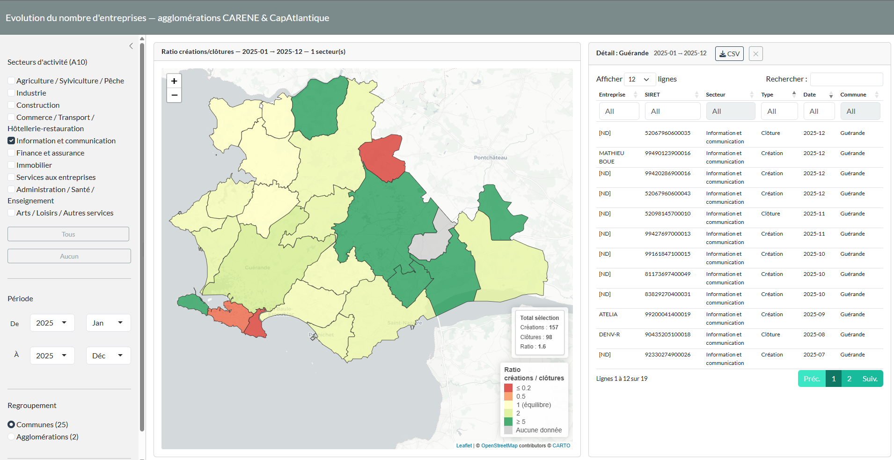

# Carte interactive — Créations & clôtures d'entreprises

[](https://escaon.shinyapps.io/open_data_gouv/)

Carte interactive visualisant le ratio créations/clôtures d'entreprises sur les
bassins d'emploi des agglomérations **CARENE** et **CapAtlantique**, par secteur
d'activité (nomenclature A10 INSEE), sur les 5 dernières années complètes.

[](https://escaon.shinyapps.io/open_data_gouv/)

## Fonctionnalités

- **Filtrage par secteur** : 10 macro-secteurs INSEE (A10) — Agriculture, Industrie, Construction, Commerce/Transport/Hôtellerie, Finance, Immobilier, Services, Santé/Enseignement, etc.
- **Filtrage par période** : sélection année + mois de début et de fin (données disponibles depuis 2021, défaut : dernière année complète)
- **Regroupement** : vue par commune (25) ou par agglomération (2)
- **Colorisation** : ratio créations/clôtures — rouge (ratio ≤ 0,2) → jaune (ratio = 1) → vert (ratio ≥ 5)
- **Popups** : détail par commune avec tableau récapitulatif par secteur
- **Tableau de détail** : clic sur une zone → liste nominative des entreprises créées/clôturées (SIRET, secteur, date, commune)

## Données

### Base Sirene — INSEE (via data.gouv.fr)

**Dataset :** [Base Sirene des entreprises et de leurs établissements (SIREN, SIRET)](https://www.data.gouv.fr/datasets/base-sirene-des-entreprises-et-de-leurs-etablissements-siren-siret/)
**Producteur :** Institut national de la statistique et des études économiques (INSEE)
**Licence :** [Licence Ouverte v2.0 (Etalab)](https://www.etalab.gouv.fr/wp-content/uploads/2017/04/ETALAB-Licence-Ouverte-v2.0.pdf)
**Fréquence de mise à jour :** mensuelle (publication ~1er du mois, données du mois précédent)

Trois fichiers Parquet sont utilisés, lus directement via DuckDB HTTP avec predicate pushdown sur le code commune :

| Fichier | Resource ID | Taille | Rôle dans l'application |
|---------|-------------|--------|--------------------------|
| `StockEtablissement_utf8.parquet` | `a29c1297-1f92-4e2a-8f6b-8c902ce96c5f` | ~2 Go | **Créations** : chaque ligne est un établissement actif. La date de création `dateCreationEtablissement` détermine le mois de création. Fournit aussi `activitePrincipaleEtablissement` (code NAF) et les dénominations. |
| `StockEtablissementHistorique_utf8.parquet` | `2b3a0c79-f97b-46b8-ac02-8be6c1f01a8c` | ~803 Mo | **Clôtures** : chaque ligne est un changement d'état. Les clôtures sont isolées par le filtre `etatAdministratifEtablissement = 'F'` ET `changementEtatAdministratifEtablissement = 'true'`. La date de clôture est `dateDebut` (date d'entrée en vigueur du changement). |
| `StockUniteLegale_utf8.parquet` | `350182c9-148a-46e0-8389-76c2ec1374a3` | ~651 Mo | **Noms d'entreprises** : jointure sur SIREN (`substr(siret, 1, 9)`) pour résoudre la dénomination — `denominationUniteLegale`, `denominationUsuelle1UniteLegale`, `nomUniteLegale`, `prenomUsuelUniteLegale` (personnes physiques). |

#### Construction des indicateurs

**Créations (mois M) :** établissements du `StockEtablissement` dont `substr(dateCreationEtablissement, 1, 7) == M` et `codeCommuneEtablissement` dans le périmètre des 25 communes.

**Clôtures (mois M) :** lignes du `StockEtablissementHistorique` avec `etatAdministratifEtablissement = 'F'`, `changementEtatAdministratifEtablissement = 'true'`, et `substr(dateDebut, 1, 7) == M`, croisées avec le `StockEtablissement` pour retrouver la commune et le secteur NAF de l'établissement.

**Ratio :** `n_créations / n_clôtures` sur la période sélectionnée. Cas limites : ratio = 5 si 0 clôture, ratio = 0 si 0 création, NA si aucune activité.

**Secteurs :** code NAF (`activitePrincipaleEtablissement`, format `XX.XXX`) agrégé en 10 macro-secteurs INSEE (nomenclature A10) par plage de codes sur les deux premiers chiffres.

#### Autres sources

| Source | Usage | Lien |
|--------|-------|------|
| API Geo (DINUM) | Contours GeoJSON des communes | [geo.api.gouv.fr](https://geo.api.gouv.fr) |

**Périmètre géographique — 25 communes :**

| Agglomération | Communes |
|---|---|
| CARENE | Besné, Donges, La Chapelle-des-Marais, Montoir-de-Bretagne, Pornichet, Saint-André-des-Eaux, Saint-Joachim, Saint-Malo-de-Guersac, Saint-Nazaire, Trignac |
| CapAtlantique | Assérac, Batz-sur-Mer, Guérande, Herbignac, La Baule-Escoublac, La Turballe, Le Croisic, Le Pouliguen, Mesquer, Piriac-sur-Mer, Saint-Lyphard, Saint-Molf, Camoël, Férel, Pénestin |

> Les 3 communes de Morbihan (Camoël 56030, Férel 56058, Pénestin 56155) sont incluses dans CapAtlantique.

## Installation et lancement

### Pré-requis

- R ≥ 4.2
- Les packages sont gérés via [`renv`](https://rstudio.github.io/renv/)

### Étapes

```r
# 1. Restaurer l'environnement renv (gère aussi leaflet.extras via renv.lock)
renv::restore()

# Si leaflet.extras n'est pas dans votre renv.lock, l'installer manuellement :
# remotes::install_github("trafficonese/leaflet.extras")

# 2. Lancer l'application
shiny::runApp(".")
```

> **Première exécution** : le chargement initial télécharge et filtre les fichiers
> Sirene depuis data.gouv.fr (~3,8 Go au total via DuckDB HTTP avec predicate pushdown).
> Durée estimée : **15 à 25 minutes** selon la connexion.
> Les résultats sont mis en cache dans `data/cache/` pour les lancements suivants.
>
> **Invalidation du cache** : supprimer `data/cache/*.rds` si vous modifiez la liste
> des communes ou si vous avez besoin de mettre à jour les données.

## Structure du projet

```
.
├── app.R                     # Application Shiny (UI + serveur)
├── setup.R                   # Installation des packages
├── R/
│   ├── 01_fetch_sirene.R     # Téléchargement Sirene via DuckDB (HTTP parquet)
│   ├── 02_process.R          # Mapping NAF→A10, agrégation commune×secteur×mois
│   ├── 03_geometry.R         # Contours communes via API Geo
│   └── 04_map_helpers.R      # Palette couleurs, popups, agrégation réactive
├── data/
│   ├── communes_ref.csv      # 25 communes avec codes INSEE corrects
│   ├── a10_labels.csv        # Nomenclature A10
│   └── cache/                # (gitignorés) Données filtrées en cache RDS
├── www/style.css
└── renv.lock                 # Versions exactes des packages R
```

## Notes techniques

### Architecture de données

- **DuckDB** lit les fichiers Parquet Sirene en HTTP avec predicate pushdown sur `codeCommuneEtablissement`, réduisant ~2 Go à ~150k lignes sans tout télécharger.
- Les **clôtures** viennent de `StockEtablissementHistorique` : ligne avec `etatAdministratifEtablissement = 'F'` + `changementEtatAdministratifEtablissement = 'true'`, la date de fermeture étant `dateDebut`.
- Les **noms d'entreprises** sont résolus via `StockUniteLegale` (jointure SIREN) : enseigne > dénomination établissement > dénomination unité légale > prénom + nom (personnes physiques) > SIRET en dernier recours.
- Le **cache RDS** dans `data/cache/` (3 fichiers, ~5 Mo) évite de re-scanner les parquets distants à chaque démarrage. À supprimer si les communes ou les colonnes requêtées changent.

### DuckDB local vs HTTP

L'approche actuelle (DuckDB HTTP + cache RDS) est adaptée au cas d'usage :
- **Avantage** : pas de 2,8 Go à stocker localement, le cache RDS (~3 Mo) est suffisant
- **Cas où DuckDB local serait utile** : si vous vouliez interroger les données avec des filtres dynamiques différents (autre périmètre géographique, autre plage temporelle) sans re-télécharger — le parquet local permettrait des re-requêtes instantanées. Pour ce projet avec 25 communes fixes, le gain est marginal.

### Complétude des données (au 12 mars 2026)

La Base Sirene est publiée mensuellement (mise à jour ~1er du mois avec données du mois précédent) :
- **2021-01 → 2025-12** : données complètes (5 années complètes)
- **2026-01** : données disponibles mais avec un léger décalage de déclaration (~2-4 semaines)
- **2026-02** : données partielles possibles (déclarations en retard)
- **2026-03** : non disponible (mois en cours)

### Palette de couleurs

Échelle linéaire par morceaux centrée sur ratio = 1 :
- ratio ≤ 0,2 → rouge foncé
- ratio = 1 → jaune/neutre (équilibre)
- ratio ≥ 5 → vert foncé
